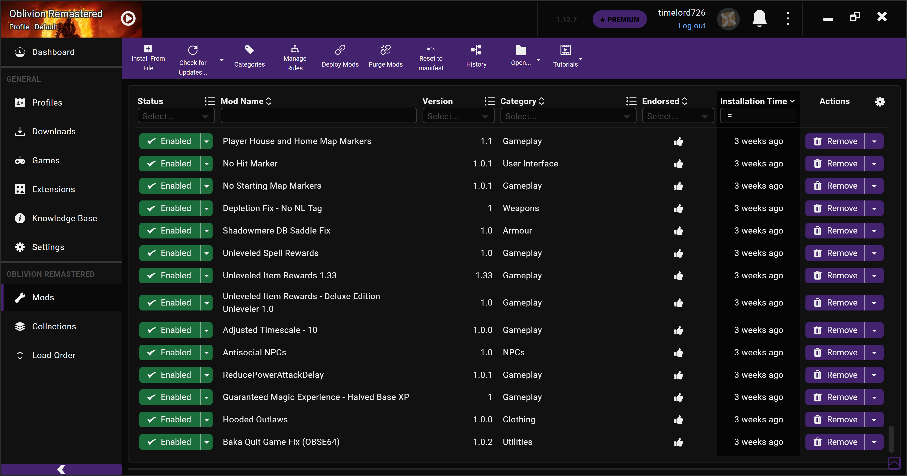
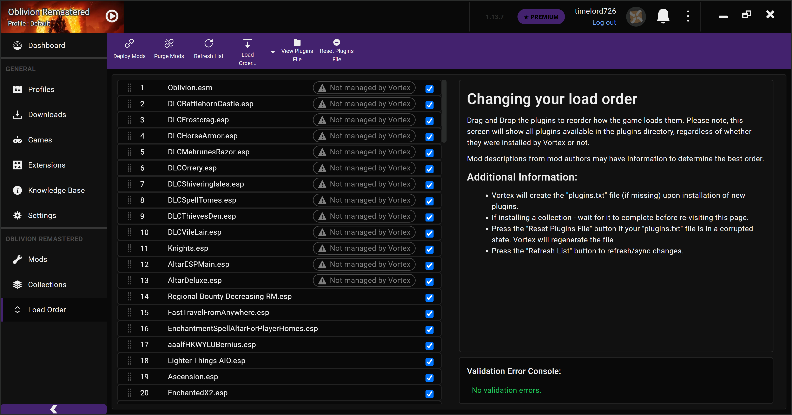

# Vortex Themes

These are my custom themes for the Vortex Mod Manager.

## Usage

Vortex themes are stored here: `C:\Users\Username\AppData\Roaming\Vortex\themes`

The `themes` directory may not exist by default and need to be created.

**WARNING:** The `variables.scss` file is automatically generated by Vortex, but it contains additional values that are not exposed through the UI. **Any changes made directly in Vortex's Theme menu will cause those values to be permanently lost**, so either avoid making changes through the UI or back up that file before applying them.

## Themes

### compact-purple

Designed to have much more compact list rows, primarily in the Mods and Load Order lists. Includes a nice purple highlight instead of the bright orange default.

</img>

</img>

